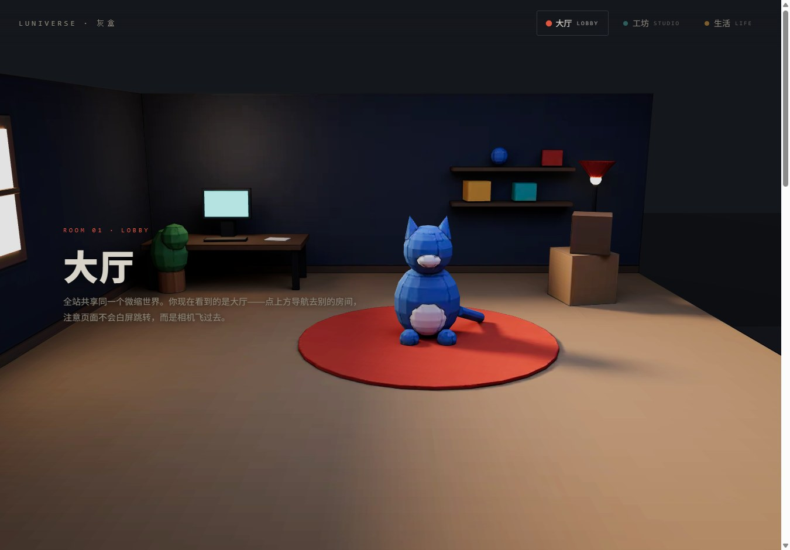
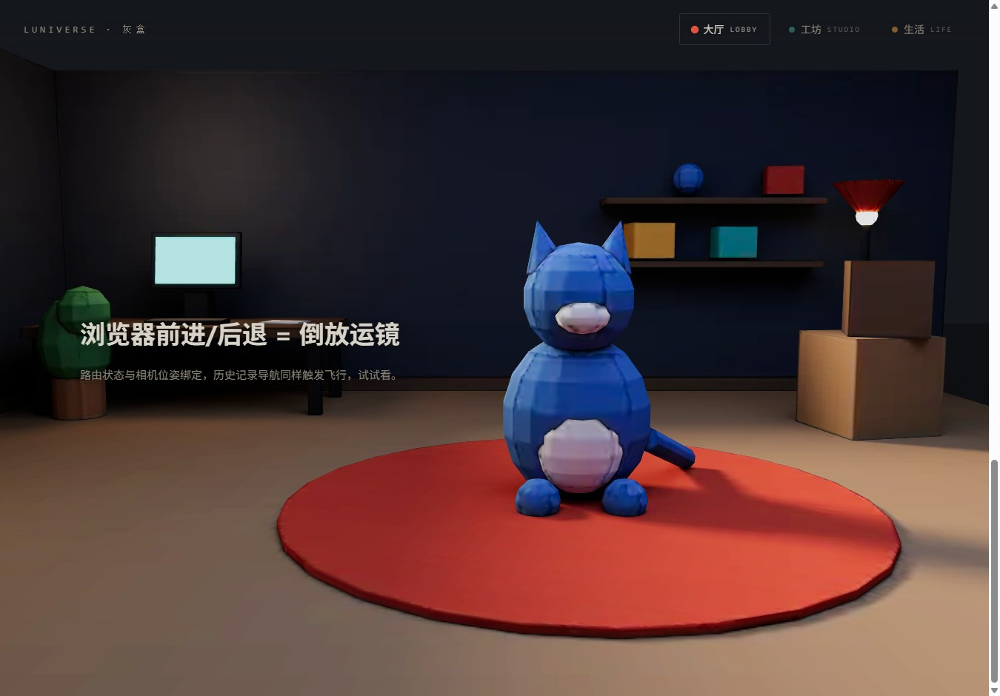
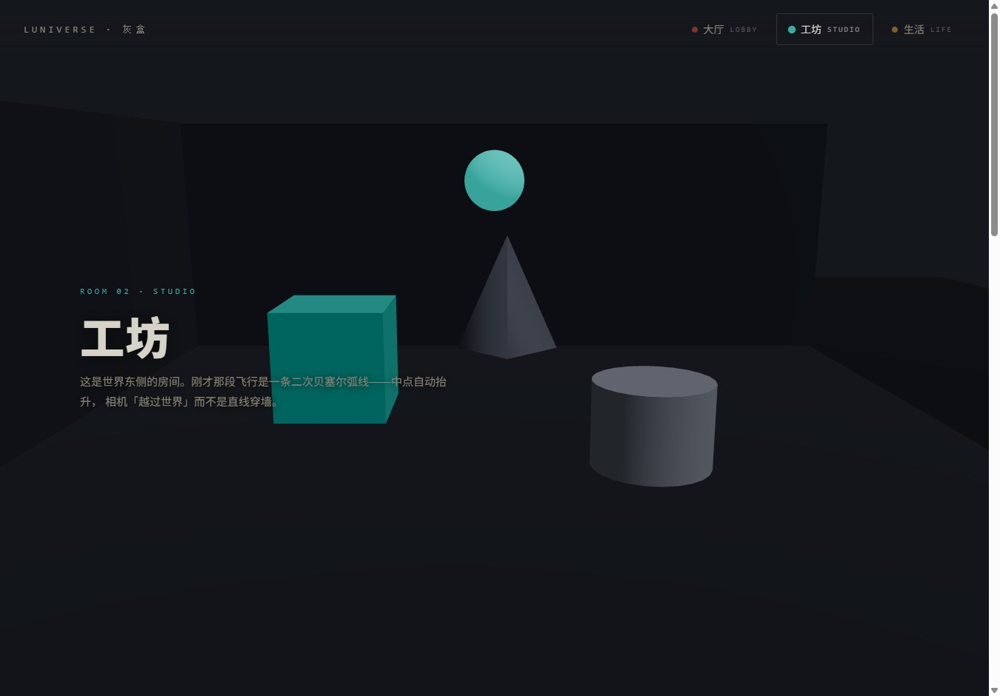

<div align="center">

# 🌙 Luniverse



> *「ページ遷移は、もう要らない。カメラが世界の中を飛ぶだけ。」*


**Next.js のルーティングを Three.js のカメラワークに直結する——全ページがひとつのミニチュア 3D 世界になり、URL を変えることは「部屋へ飛ぶこと」になる。**

<sub>Next.js 15 · React Three Fiber 9 · Lenis · GSAP · Blender ヘッドレスベイク</sub>

受賞系クリエイティブサイトの「単一ワールド・ナビゲーション」を、依存 8 個・全ファイル読める規模で丸ごと実装した最小骨格。白画面のページ遷移に飽きたら、これをベースに自分の世界を建てればいい。

**[▶ オンラインデモ](https://shushuitie2017.github.io/luniverse/)** · [見た目](#見た目--効果) · [動かす](#動かす) · [仕組み](#仕組みルーティングカメラの-4-手) · [中文](#中文) · [English](#english)

</div>

---

## 見た目 / 効果

**部屋の中でスクロールすると、カメラがドリーインする**——DOM のテキストと WebGL カメラが同じスクロール値を消費している：



**同じ骨格に、グレーボックスの部屋とベイク済みの部屋が同居する**——先に骨格を証明し、後から部屋を一つずつ差し替える開発フロー：

| M1 グレーボックス（STUDIO） | M2 ベイク済み（LOBBY） |
|---|---|
|  |  |
| プリミティブ + ライト実算 | **照明を全部テクスチャに焼き込み、実行時はライト 0 灯** |

**ナビゲーションをクリックすると白画面にならない。カメラが二次ベジェ弧（中点自動リフト）で隣の部屋へ飛ぶ。** ブラウザの「戻る」は運鏡の逆再生、`/studio` を直接開けばハードカットで着地。実測 60fps（平均 16.6ms / 最悪 16.9ms）。

## 動かす

まず **[オンラインデモ](https://shushuitie2017.github.io/luniverse/)** をどうぞ。手元で動かすなら：

```bash
pnpm install && pnpm dev   # → http://localhost:3012
```

部屋を自分でベイクし直すなら（Blender 4.5 headless、GPU なら数秒）：

```bash
blender -b -P tools/bake_workshop.py -- tools/out
pnpm dlx @gltf-transform/cli webp tools/out/workshop-raw.glb public/models/workshop.glb
```

## 何が入っているか

| 部品 | 中身 |
|---|---|
| 🎥 **カメラ＝ルーター** | ルート変更 → 二次ベジェ弧の飛行 1.8s。飛行中の割り込みは現在姿勢から継続、ディープリンクはハードカット（`webgl/CameraRig.tsx`） |
| 🌀 **統一 rAF 心拍** | サイト全体で `requestAnimationFrame` は 1 本だけ。GSAP → Lenis → R3F を priority 順で駆動（`lib/frame.ts`、約 30 行） |
| 📜 **スクロール・ドリー** | Lenis の進捗 0..1 がそのままカメラの camera→dolly 補間に入る。部屋を替えるとスクロールはリセット |
| 🏠 **ベイク部屋パイプライン** | Blender Python 1 本でモデリング→Cycles ベイク→GLB 出力。WebP 圧縮後 **240KB**、実行時は unlit マテリアルでライト計算ゼロ |
| 🗺️ **部屋の増設 = 2 ファイル** | `lib/rooms.ts` に 1 レコード + `app/<room>/page.tsx` を足すだけ |
| 🔍 **SEO はそのまま** | テキストは全部 DOM に残す設計。Lighthouse は SEO / A11y / Best Practices 全部 **100** |

## 仕組み（ルーティング→カメラの 4 手）

1. **DOM 側**が `usePathname()` を監視し、ルートを zustand ストアへ書く——R3F は別レコンサイラなので、Canvas 内で Next.js のフックは呼ばない。
2. **Canvas 内の CameraRig** がストアを購読。ルートが変わったら現在の実姿勢を起点として捕捉し、GSAP で `t: 0→1` を補間。
3. **毎フレーム**、二次ベジェ（中点を飛距離に応じて持ち上げる）で位置を、lerp で注視点を合成して `camera.lookAt()`。
4. **到着後**は Lenis のスクロール進捗がドリー補間を引き継ぐ。全部が単一 rAF の上で動くので、DOM と WebGL がズレない。

## 正直な限界

- 部屋は 3 つ、ベイク済みは LOBBY のみ（STUDIO / LIFE はまだグレーボックス）。
- ローポリ美術。フォトリアルが欲しい人向けではない。
- テクスチャは WebP（KTX2/Basis はまだ）。GPU メモリ最適化は伸び代。
- 実測はデスクトップ Chrome。モバイルのチューニングは未着手。

## 名前の由来

**Luniverse = Luna + Universe。** 月くらい小さいけれど、ちゃんと重力のある宇宙——ページの集合ではなく「一つの世界」としてサイトを建てる、という設計思想をそのまま名前にした。住人の青い猫は当工房の看板猫。

## 関于作者


| | |
|---|---|
| GitHub | [@shushuitie2017](https://github.com/shushuitie2017) |
| WeChat | ↑ スキャンでどうぞ |

### 也在做 / Also by me

| プロジェクト | 一言 |
|---|---|
| [folio-2026](https://shushuitie2017.github.io/folio-2026/) | 車で走り回れる 3D ポートフォリオ（物理エンジン駆動） |
| [game-book](https://shushuitie2017.github.io/game-book/) | 任天堂流レベルデザインの教科書サイト、Lighthouse オール 100 |
| [GameBox](https://shushuitie2017.github.io/GameBox/) | ブラウザ 3D ゲーム部品 74 モジュール、ライブデモ付き |

## ライセンス

**MIT —— ご自由にどうぞ。**

---

## 中文

**把 Next.js 路由直连 Three.js 运镜——全站共享一个微缩 3D 世界，切换 URL = 相机飞到那个房间。** 点导航不再白屏跳转，相机沿二次贝塞尔弧线飞行；浏览器后退 = 倒放运镜；深链接直达硬切；实测 60fps。

- **统一 rAF**：全站只有一个 `requestAnimationFrame`（`lib/frame.ts` 约 30 行），GSAP / Lenis / R3F 按优先级挂载，DOM 与 WebGL 永不撕裂。
- **烘焙房间管线**：`tools/bake_workshop.py` 一个 Blender 脚本完成建模→Cycles 烘焙→GLB 导出，WebP 压缩后 **240KB**，运行时 unlit 零灯光。
- **加房间 = 2 个文件**：`lib/rooms.ts` 加一条记录 + 一个 page。
- **SEO 不牺牲**：文字全留 DOM，Lighthouse 四项全 100。

```bash
pnpm install && pnpm dev   # → http://localhost:3012
```

## English

**Wire Next.js routing straight into a Three.js camera rig** — the whole site is one miniature 3D world; changing the URL means flying to another room. No white-flash page loads: the camera travels along a quadratic Bézier arc (auto-lifted midpoint), browser back replays the move in reverse, deep links hard-cut on arrival. Measured 60fps.

- **One rAF heartbeat** for the entire site (`lib/frame.ts`, ~30 lines): GSAP, Lenis and R3F all tick as prioritized subscribers.
- **Baked-room pipeline**: a single headless Blender script models, bakes and exports the room; **240KB** after WebP compression, rendered unlit at runtime.
- **Adding a room = 2 files**: one record in `lib/rooms.ts` plus one page.
- **SEO intact**: all copy stays in the DOM — Lighthouse 100 across SEO / A11y / Best Practices.

```bash
pnpm install && pnpm dev   # → http://localhost:3012
```

---

<div align="center">

*「ページ遷移は、もう要らない。カメラが世界の中を飛ぶだけ。」*

**[▶ shushuitie2017.github.io/luniverse](https://shushuitie2017.github.io/luniverse/)**

</div>
